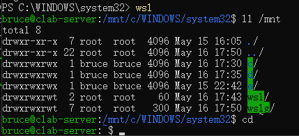
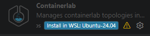

# 安装WSL Ubuntu-22.04

## 安装WSL
### 1. 开启Windows功能

Win+R -> optionalfeatures

 

### 2. 安装WSL Ubuntu 22.04

管理员打开powershell,输入：
```bash
wsl --install Ubuntu-24.04
```

 

## 进入Ubuntu，安装相关软件

### 1. Powershell或者APP 进入
```bash
wsl
```



### 2. 更新Ubuntu软件：
```bash
sudo apt update && sudo apt upgrade -y
```

### 3. 安装Containerlab：
[Containerlab使用说明传送门](https://containerlab.dev/install/)
```bash
curl -sL https://containerlab.dev/setup | sudo -E bash -s "all"
```

### 4. 创建clab文件夹
```bash
mkdir clab
```

### 5. 下载Arista公司的cEOS镜像
使用邮箱注册即可进入下载页面，注意有些邮箱无法注册，大家注册的时候遇到问题就试试其他邮箱
```bash
https://www.arista.com/zh/support/software-download
```
选择对应版本下载
```bash
cEOS64-lab-4.35.3.1F.tar
```

## VScode连接WSL
### 准备工作

#### 1. 安装WSL插件

WSL插件用来连接本机WSL Ubuntu


#### 2. 安装containerlab插件

Containerlab插件实验增强


### VScode连接WSL Ubuntu
#### 1. VScode连接到Ubuntu，打开对应文件夹
按：
```bash
Ctrl + Shift + P
```

输入：
```bash
WSL: Connect to WSL
```
Open Host 
```bash
/home/bruce
```
#### 2. 安装Containerlab插件到Ubuntu


### 导入cEOS镜像
```bash
 sudo docker load -i cEOS64-lab-4.35.3.1F.tar
```


