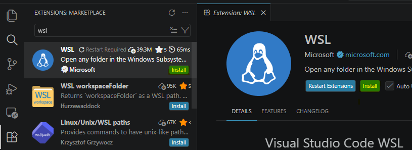
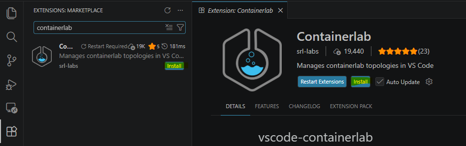

# 安装WSL Ubuntu-22.04

## 什么是WSL

**Windows Subsystem for Linux - 适用于Linux的Windows子系统**

它允许用户直接在Windows里运行Linux环境，而无需：
- VMware
- VirtualBox
- 双系统

即可获得完整的Linux命令行环境

## 安装WSL
### 1. 开启Windows功能

Win+R -> optionalfeatures

 

### 2. 安装WSL Ubuntu 22.04**

管理员打开powershell,输入：
```bash
wsl --install Ubuntu-24.04
```

 

## 进入Ubuntu

### 1. Powershell 进入
```bash
wsl
```
！[Powershell进入Ubuntu](images/powershell进入Ubuntu.png)

### 2. APP 进入

## VScode连接WSL
### 准备工作
#### 安装插件
##### 安装WSL插件

WSL插件用来连接本机WSL Ubuntu



##### 安装containerlab插件

Containerlab插件实验增强



#### 创建clab文件夹
```bash
mkdir clab
```

### VScode连接WSL Ubuntu

按：
```bash
Ctrl + Shift + P
```

输入：
```bash
WSL: Connect to WSL
```
Open Host /home/bruce/clab

### 更新Ubuntu软件：
```bash
sudo apt update && sudo apt upgrade -y
```

[Containerlab使用说明传送门](https://containerlab.dev/install/)

### 安装Containerlab：
```bash
curl -sL https://containerlab.dev/setup | sudo -E bash -s "all"
```
### 下载Arista公司的cEOS镜像


### 导入cEOS镜像
```bash
 sudo docker import cEOS64-lab-4.35.3.1F.tar ceos:4.35.3.1F
```


